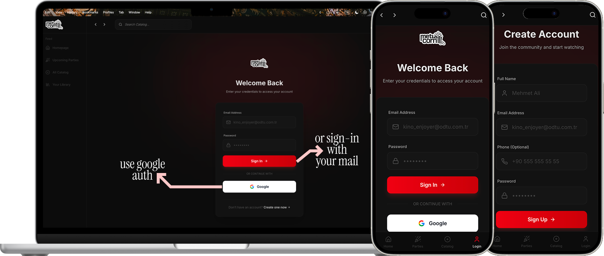

# metucorn


This app created for STAT311: Modern Database Systems course of Middle East Technical University from a group of juniors: Burak Şahin Küçük, Fajrin A., Ahmet T., Pelin İ.



## About

metucorn is a modern movie watching party platform that allows users to purchase tickets, create watch parties, and enjoy synchronized movie viewing experiences with friends. Built as a comprehensive database systems project, it demonstrates advanced PostgreSQL features.

## Features

### User Features
- **Movie Catalog**: Browse and search through an extensive collection of movies with detailed information including ratings, genres, directors, and cast
- **Ticket Purchase**: Secure ticket purchasing system with QR code generation for easy access
- **Watch Parties**: Create and join synchronized movie watching parties with friends
- **Real-time Synchronization**: Watch movies together with synchronized playback controls
- **Rating & Reviews**: Rate and review movies after watching
- **User Profile**: Manage personal information and view ticket history
- **Google OAuth**: Quick and secure authentication with Google accounts

### Admin Features
- **Movie Management**: Add, edit, and delete movies from the catalog
- **User Management**: View and manage user accounts
- **Party Management**: Monitor and manage watch parties
- **Analytics Dashboard**: View comprehensive statistics and charts
- **Review Moderation**: Manage user reviews and ratings

## Tech Stack

- **Frontend**: Next.js 14, React 18, TypeScript
- **Styling**: Tailwind CSS
- **Database**: PostgreSQL (via Supabase)
- **Authentication**: Supabase Auth with Google OAuth
- **Video Player**: React Player
- **Charts**: Recharts
- **QR Codes**: qrcode.react
- **Icons**: Lucide React

## Database Architecture

The application uses a comprehensive PostgreSQL database with:
- **Row Level Security (RLS)**: Implemented for data access control
- **UUID Primary Keys**: For all tables
- **Foreign Key Relationships**: Properly normalized schema
- **Custom Types**: ENUMs for status fields
- **Triggers**: Automatic timestamp updates
- **Indexes**: Optimized for performance

### Key Tables
- `client`: User profiles linked to Supabase Auth
- `movie`: Movie catalog with metadata
- `watch_party`: Party scheduling and management
- `ticket`: Ticket purchases and access codes
- `payment`: Payment transaction records
- `rating` & `review`: User feedback system
- `party_participant`: Many-to-many relationship for party members

## Getting Started

### Prerequisites

- Node.js 18+ and npm
- Supabase account (free tier works)
- Google OAuth credentials (for OAuth login)

### Installation

1. Clone the repository:
```bash
git clone https://github.com/busahinku/metucorn.git
cd metucorn
```

2. Install dependencies:
```bash
npm install
```

3. Set up environment variables:
Create a `.env.local` file in the root directory:
```env
NEXT_PUBLIC_SUPABASE_URL=your_supabase_url
NEXT_PUBLIC_SUPABASE_ANON_KEY=your_supabase_anon_key
```

4. Set up the database:
- Run `schema.sql` to create the database schema
- Run `rls-index-trigger-funcs.sql` for RLS policies, indexes, and triggers
- (Optional) Run `sample-data.sql` for sample data
- (Optional) Run `generate-500-users.sql` for test users

5. Run the development server:
```bash
npm run dev
```

6. Open [http://localhost:3000](http://localhost:3000) in your browser.

## Project Structure

```
metucorn/
├── app/                    # Next.js app router pages
│   ├── admin/             # Admin dashboard pages
│   ├── movies/            # Movie catalog pages
│   ├── parties/           # Watch party pages
│   ├── watch/             # Movie player pages
│   └── ...
├── components/            # Reusable React components
│   ├── admin/            # Admin-specific components
│   └── ...
├── lib/                   # Utility libraries
│   ├── supabase/         # Supabase client configurations
│   └── admin/            # Admin utilities
├── public/                # Static assets
├── doc/                   # Documentation and assets
└── schema.sql            # Database schema
```

## Key Features Implementation

### Watch Party Synchronization
Parties allow multiple users to watch movies together with synchronized playback. The host controls playback, and all participants see the same frame.

### Ticket System
- Each ticket purchase generates a unique access code
- QR codes are generated for easy ticket validation
- Tickets can be linked to specific watch parties

### Security
- Row Level Security (RLS) policies ensure users can only access their own data
- Admin routes are protected with role-based access control
- Secure authentication via Supabase Auth

## Development

### Available Scripts

- `npm run dev`: Start development server
- `npm run build`: Build for production
- `npm run start`: Start production server
- `npm run lint`: Run ESLint

## Deployment

The application is designed for zero-cost deployment:
- **Frontend**: Vercel (free tier)
- **Database**: Supabase (free tier)

See `vercel.json` for deployment configuration.

## Database Files

- `schema.sql`: Complete database schema with tables, types, and relationships
- `rls-index-trigger-funcs.sql`: RLS policies, indexes, and trigger functions
- `sample-data.sql`: Sample data for testing
- `generate-500-users.sql`: Script to generate test users

## Contributing

This is an academic project for STAT311: Modern Database Systems course. Contributions are welcome for educational purposes.

## License

This project is created for educational purposes as part of the STAT311 course at Middle East Technical University.

## Team

- Burak Şahin Küçük
- Fajrin A.
- Ahmet T.
- Pelin İ.

---

Made with ❤️ for STAT311: Modern Database Systems
